# pixel-pomodoro-pet

*Read this in [English](README.en.md).*

Pomodoro de escritorio siempre visible con una mascota pixel-art developer.

Una ventana sin bordes, transparente y **always-on-top** que flota sobre el
editor. Un pato de goma —el del *rubber duck debugging*— reacciona a lo que
estás haciendo: se concentra contigo, descansa contigo y celebra cuando cierras
un pomodoro.

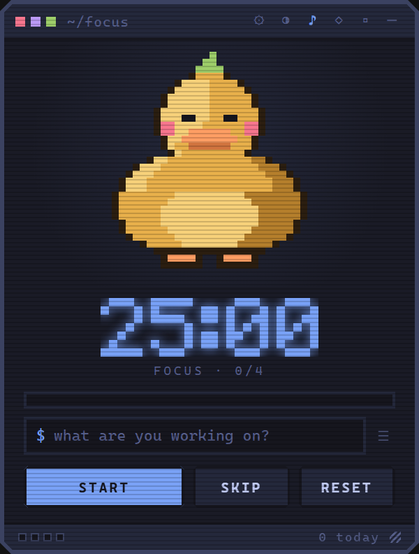

La mascota comenta lo que va pasando, en el personaje y la voz que elijas —
acá Pip, en tono `MEDIC`:

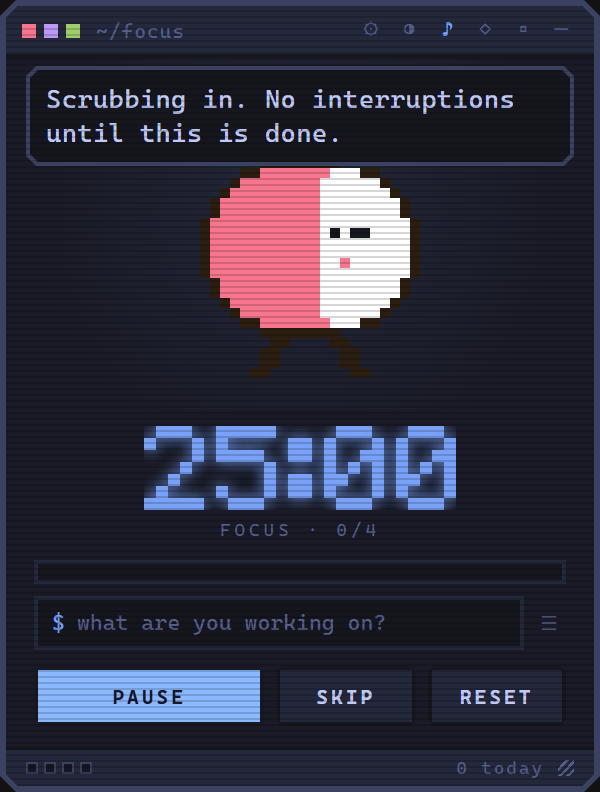

Cambiar de tema repinta también a la mascota. Seis paletas de editor, todas
con el mismo pato:

| Tokyo Night | Dracula | Gruvbox |
| --- | --- | --- |
| 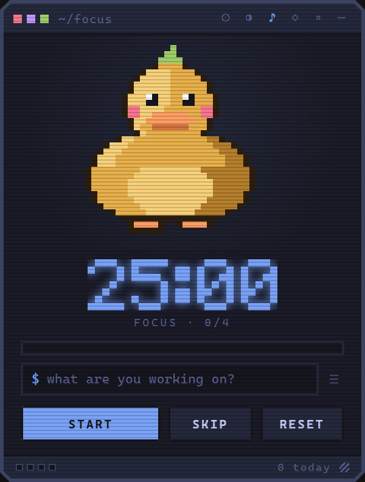 | 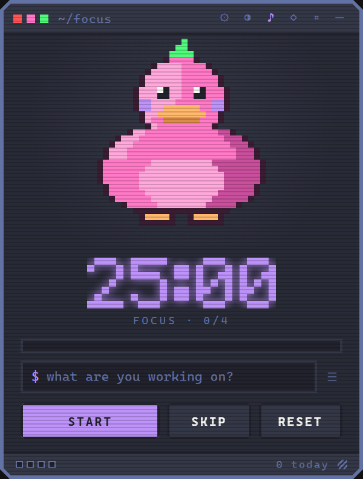 | 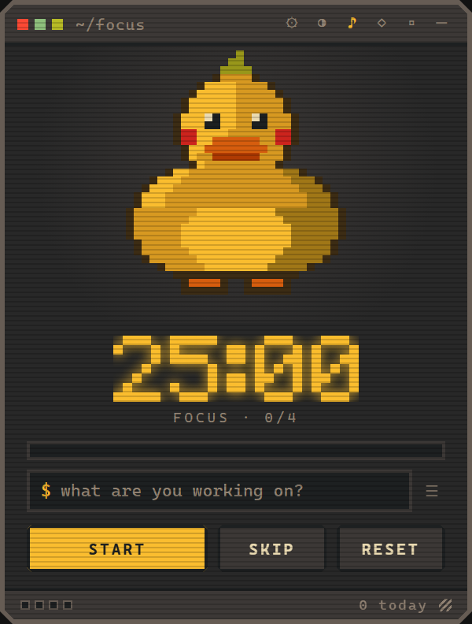 |

| Nord | Catppuccin | Solarized Dark |
| --- | --- | --- |
| 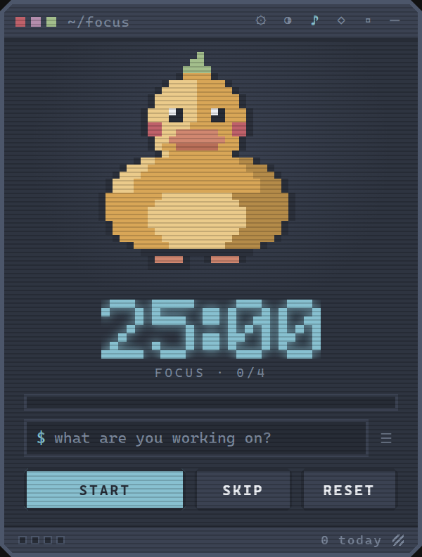 | 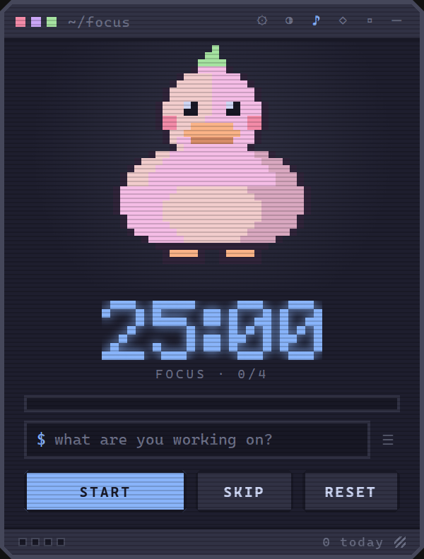 | 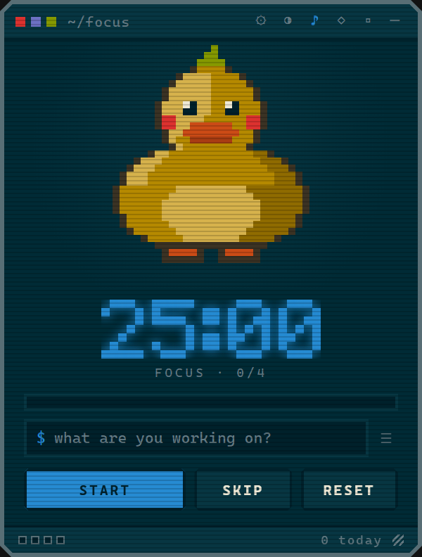 |

Ocho personajes intercambiables desde ajustes, sin arte reciclado entre
ellos:

| Duck | Ninja | Terminal | Spark |
| --- | --- | --- | --- |
| 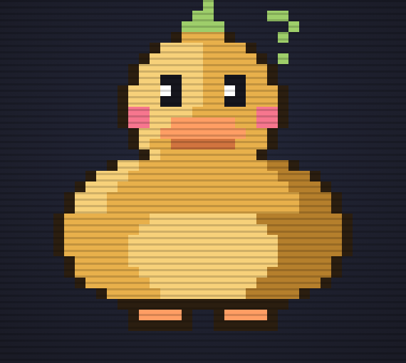 | 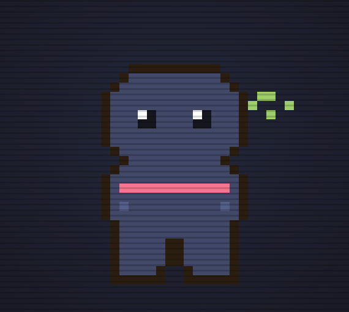 | 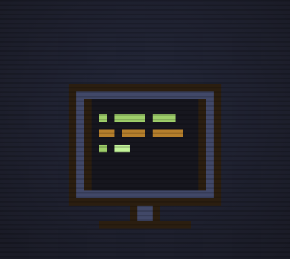 | 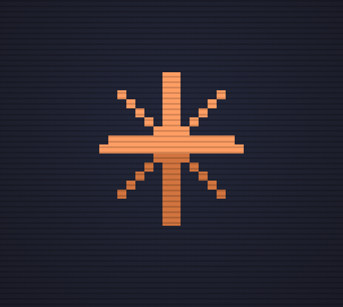 |

| Gato pulpo | Bicho | Café | **Pip** |
| --- | --- | --- | --- |
| 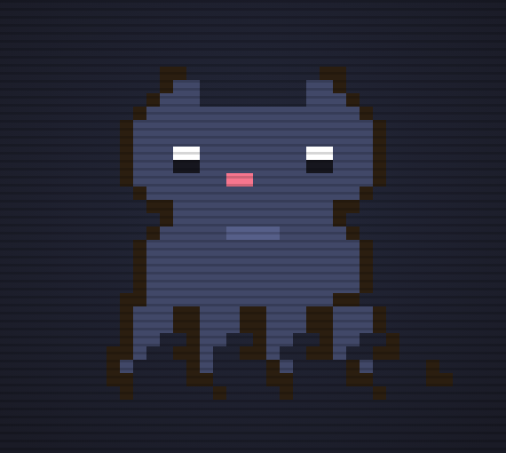 | 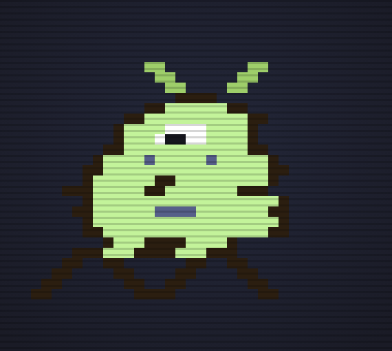 | 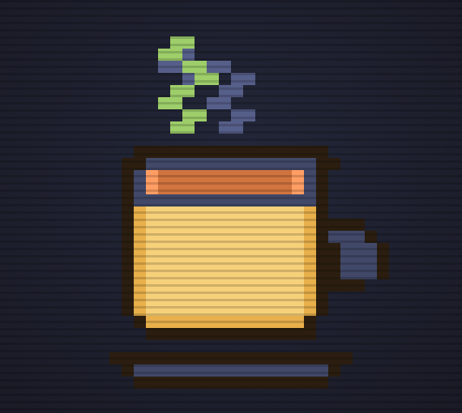 | 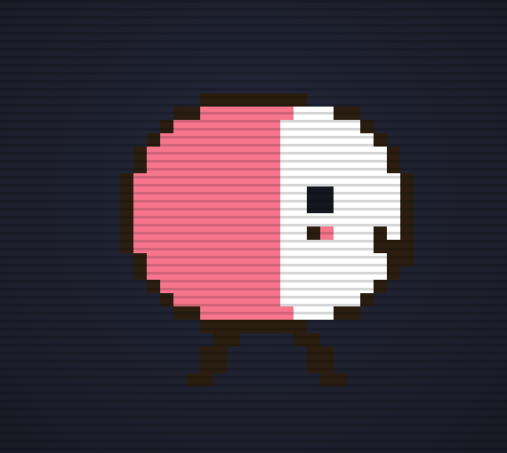 |

Un checklist real detrás del mismo campo de siempre: una tarea activa, el
resto en cola, y cada pomodoro suma solo a la que está activa sin que hagas
nada.

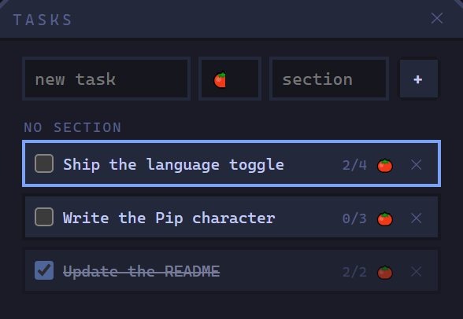

El contador de abajo abre tu historial: racha, récords y un heatmap del
último año.

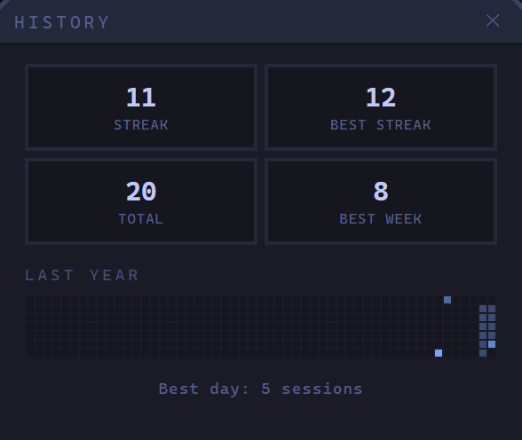

Duraciones, tamaño, opacidad al desatender, personaje, voz y objetivo diario,
todo detrás del engrane:

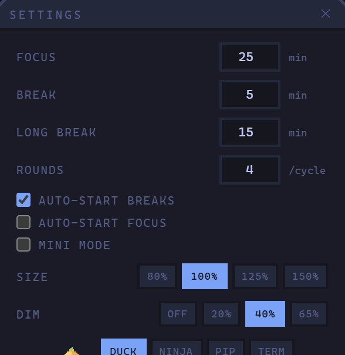

Y todo lo anterior, en inglés o en español — un chip más en el mismo panel,
sin reiniciar la app. Frases, recordatorios, atajos y toda la interfaz
cambian juntos:

| English | Español |
| --- | --- |
| 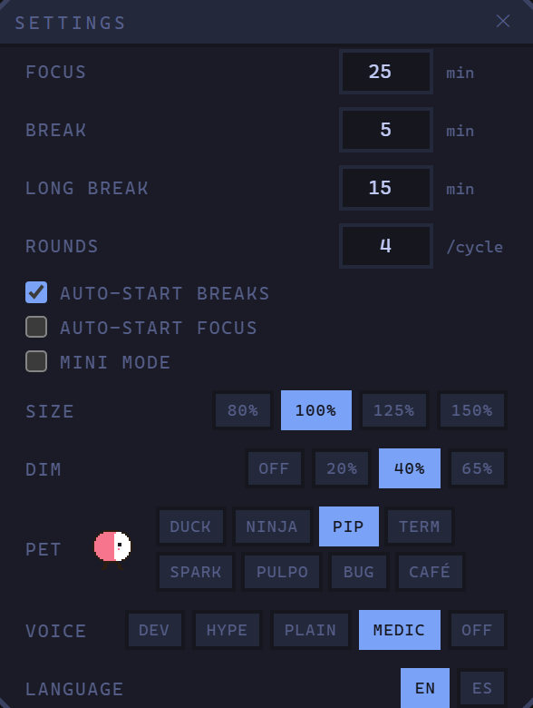 | 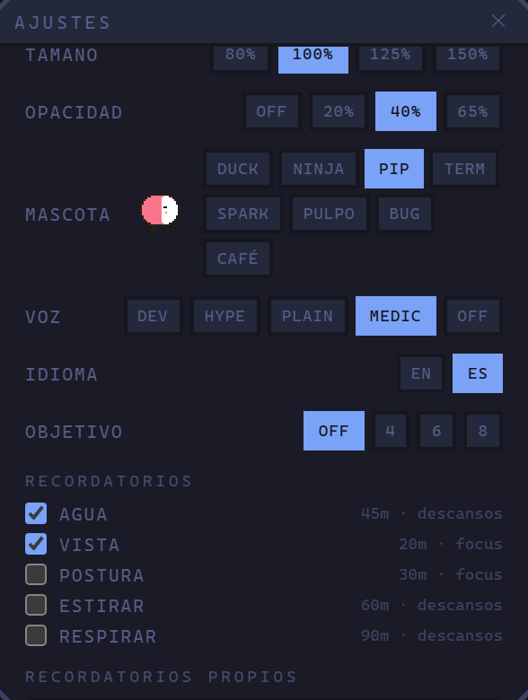 |

Y si querés que ocupe lo mínimo posible, el modo mascota lo reduce a la
silueta y el reloj — el resto vuelve al pasar el mouse:

| Modo mascota | Al pasar el mouse |
| --- | --- |
| 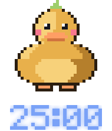 | 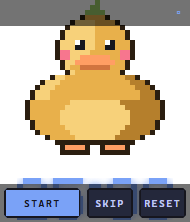 |

## Qué tiene

- **Timer pomodoro completo**: 25 / 5 / 15 configurables, rondas por ciclo y
  descanso largo. Los descansos arrancan solos; el siguiente focus no, para que
  volver sea una decisión consciente.
- **Mascota con vida propia**: conductas repartidas en cinco estados de ánimo.
  No repite un bucle — al terminar cada actuación saca otra con pesos, así que
  casi siempre respira, a veces mira de reojo, de vez en cuando algo le llama
  la atención arriba y cada tanto se pasea un par de píxeles sin motivo. Se
  concentra en focus, tararea en el descanso y se duerme en pausa.
- **Ocho personajes intercambiables** desde ajustes, repartidos en dos
  familias. *Criaturas* — el pato, un ninja, un gato pulpo, un bicho y
  **Pip**, una pastillita con cara de buen humor — con cuerpo, parpadeo y
  andar propios. *Emblemas* — una terminal CRT, una chispa y una taza de
  café — que no pueden parpadear ni caminar sin verse mal, así que animan
  *efectos* en su lugar: la terminal parpadea su cursor y se tipea sola y
  entra en standby; la chispa pulsa el núcleo, pasea un brillo por sus rayos
  y queda en brasa al pausar; la taza suelta vapor que se enfría al pausar.
  Cambiar de tema repinta a los ocho.
- **La mascota habla**: comenta al arrancar, al cerrar una sesión, al entrar
  al descanso y de vez en cuando por su cuenta. Cinco voces —`DEV` con humor
  seco, `HYPE` motivacional, `PLAIN` solo lo funcional, `MEDIC` con humor de
  guardia médica (el compañero natural de Pip, aunque cualquier personaje
  puede hablar en cualquier voz) y `OFF` para callarla— y frases que saben en
  qué fase estás, cuántos pomodoros llevas y qué hora es. Clic para
  descartar.
- **Toda la app en inglés o en español**, un chip más en ajustes. No es
  media traducción: interfaz, las más de 130 frases del catálogo y los cinco
  packs de recordatorios cambian juntos, sin reiniciar. Por diseño, los dos
  idiomas comparten un único origen de verdad para *cuándo* sale cada frase
  (disparador, tono, condiciones) — una traducción faltante o demasiado
  larga rompe un test antes de llegar a la burbuja, así que los dos idiomas
  nunca pueden divergir en qué frase suena, solo en qué dice.
- **Un ánimo que sale del uso real, no del azar**: cuatro horas seguidas sin
  un descanso de verdad, u ocho pomodoros en el día, y el pato se ve y suena
  cansado — pide prestadas las animaciones de la pausa en vez de necesitar
  arte nuevo para "cansado". Una racha de tres días o más y hay frases que lo
  notan. Y si desaparecés bastante más que una pausa para café, el saludo al
  volver ya no es el mismo.
- **Recordatorios anclados a la fase**: agua, vista (regla 20-20-20), postura,
  estiramiento y respiración. Lo que importa no es la lista sino *cuándo*
  caen: los de levantarse llegan en el descanso, cuando de verdad te podés
  parar; los de vista durante el focus, que es cuando llevas veinte minutos
  sin parpadear. Cuentan **tiempo de sesión, no tiempo de reloj** — dejar el
  widget abierto sin usarlo no acerca ningún recordatorio. Agua y vista vienen
  encendidos; el resto los prendés vos.
- **Modo silencio** de 30 min, 1 h o 2 h para llamadas y presentaciones. Se
  anuncia en la barra de título con lo que le queda y se apaga solo.
- **Checklist del día**: el mismo campo de siempre, pero ahora respaldado por
  tareas de verdad. Escribir ahí solo renombra la tarea activa — una segunda
  tarea siempre se agrega desde el panel de la lista (☰, junto al campo), con
  estimación opcional en pomodoros. Cada sesión de focus que se cierra suma
  sola a la tarea activa, sin que hagas nada; cambiar de tarea es un clic en
  la lista, no hay que retipear el nombre. Un objetivo diario opcional
  (ajustes → goal) hace que el contador de abajo pase de "3 today" a
  "3/6 today".
- **Historial, rachas y heatmap** detrás del contador "N today": racha
  actual, mejor racha, total y mejor semana, más un heatmap de 53 semanas
  estilo GitHub. La racha perdona un día vacío por semana — descansar un
  sábado no te hace perder meses de constancia.
- **Ajustes editables** detrás del engrane: duraciones de focus, descanso corto
  y largo, rondas por ciclo y auto-arranque. Cambiar una duración con el timer
  corriendo respeta el tiempo que ya llevas.
- **Tamaño ajustable** — cuatro presets (80 / 100 / 125 / 150 %) y un grip en
  la esquina para redimensionar arrastrando. La ventana nativa se redimensiona
  con la interfaz, y el pixel art se mantiene nítido en cada escala.
- **Seis temas de editor** — Tokyo Night, Dracula, Gruvbox, Nord, Catppuccin
  y Solarized Dark. Cambiar de tema **repinta también a la mascota**, no
  solo la interfaz.
- **Reloj en fuente pixel propia**, dibujada con el mismo motor de sprites que
  la mascota. Nítida a cualquier escala y sin un solo asset binario.
- **Auto-fade**: seis segundos después de arrancar una sesión el widget baja de
  opacidad y vuelve al pasar el mouse. Sin esto, algo que se superpone a todo
  se vuelve insoportable en una hora. El nivel (20/40/65 %, o apagado del todo)
  se elige en ajustes.
- **Modo click-through**: el widget deja de capturar el mouse por completo y
  flota de verdad sobre el IDE.
- **Modo mascota**: encoge la ventana a solo el personaje y el reloj, sin
  título ni controles — el resto vuelve al pasar el mouse por encima. Pensado
  para dejarlo flotando en una esquina sin que ocupe más lugar que el pato.
- **Bandeja del sistema y hotkeys globales**, para manejar el timer sin salir
  del editor.
- **No roba el foco**: aparece sin robarle el teclado a lo que estés haciendo,
  que es la diferencia entre un widget y un estorbo.
- **Recuerda dónde lo dejaste**: posición y tamaño de la ventana, tema, tarea y
  pomodoros del día.

## Atajos

Todos son reasignables desde ajustes → shortcuts, con detección de
conflictos entre ellos y sin dejar un atajo fantasma si el sistema operativo
rechaza el nuevo. La tabla muestra los valores por defecto.

| Atajo | Acción |
| --- | --- |
| `Ctrl+Alt+Space` | Start / Pause |
| `Ctrl+Alt+N` | Saltar fase |
| `Ctrl+Alt+R` | Reiniciar fase |
| `Ctrl+Alt+G` | Click-through on / off |
| `Ctrl+Alt+Z` | Modo mascota on / off |
| `Ctrl+Alt+H` | Ocultar / mostrar el widget |

Los tres últimos existen porque sus botones son **puertas de una sola dirección**:
un widget que ignora el cursor, que quedó reducido al pato o que está oculto no
se puede clickear para deshacerlo — el botón para deshacerlo puede no estar
visible, o el mouse puede no llegarle. La bandeja también sirve, pero su icono
se pierde con facilidad en los iconos ocultos de Windows, así que el teclado es
la salida garantizada. Cerrar y volver a abrir la app también limpia el
click-through: ese estado no se persiste, a propósito.

Mientras el click-through está activo, la barra de título lo dice —
`~/focus [ghost]`— porque si no, el modo sería invisible.

## Desarrollo

```bash
npm install
npm run app:dev      # app nativa con hot reload
npm run dev          # solo el frontend, en el navegador
npm test             # tests del núcleo y de los sprites
npm run typecheck    # app + tooling de build
npm run app:build    # instalador NSIS para Windows
npm run icons        # regenera los iconos desde el sprite del pato
```

Requiere Node 20+ y el toolchain de Rust. En Windows además hacen falta las
Build Tools de MSVC y WebView2 (ya viene con Windows 10/11).

## Arquitectura

```
src/
  core/        Timer, fases, frases, recordatorios, historial, ánimo y tareas. Puro.
  sprites/     Datos de pixel art (JSON) + renderer a canvas + temas.
  messages/    Catálogo de frases y packs de recordatorios (JSON) + validación.
  i18n/        Idioma activo, diccionario de interfaz y el aplicador al DOM.
  ui/          DOM, canvas de la mascota y del reloj, burbuja, paneles.
  platform/    Única frontera con Tauri, detrás de una interfaz.
  store/       Preferencias, historial y tareas, con lectura defensiva.
  audio/       Blips chiptune sintetizados con WebAudio.
src-tauri/     Ventana, bandeja y hotkeys. Nada de lógica de dominio.
tests/         Vitest sobre core/, store/, sprites/ y messages/.
```

Once decisiones que vale la pena explicar:

**El timer es un reducer puro.** `reduce(state, event, settings)` no toca el
reloj ni el DOM, así que los casos incómodos —descanso largo al cuarto round,
saltar una fase, auto-start— se prueban sin levantar la app. El `Ticker` mide
tiempo real transcurrido en vez de confiar en que el `setInterval` disparó
puntual, de modo que una webview throttleada o un portátil suspendido no
desfasan la cuenta.

**Los sprites son datos, no imágenes.** Cada personaje es un JSON en
`sprites/characters/` con su grilla, sus parches y sus conductas — el motor no
sabe qué es un pato, y agregar un personaje es soltar un archivo. La grilla es
de caracteres que indexan una paleta compartida por temas, así el arte es
diffeable en git, pesa bytes y cambiar de tema repinta a todos los personajes.
Las expresiones son *parches* de unos pocos píxeles sobre la base: con ojos de
dos píxeles de lado, mirar de reojo es mover el brillo al otro lado y mirar
abajo es que la fila de arriba tome el color del cuerpo — más barato y más
legible que redibujar una cara. Un registro estricto valida todo al cargar:
un personaje malformado rompe un test, no la pantalla.

**Las reglas de "no ser molesto" son código puro y testeado.** Lo que decide
si el pato habla —`speak(estado, petición, catálogo, random)`— y lo que decide
si un recordatorio toca —`dueReminder(estado, chequeo, packs, random)`— reciben
el reloj y el azar como argumentos. Así el enfriamiento entre frases, el no
repetir lo último dicho, las condiciones por hora o por pomodoros del día y la
cadencia de cada pack se prueban sin levantar la app. Ahí está el verdadero
riesgo de estas funciones: una mascota que habla de más se desinstala, y eso no
se verifica mirándola un rato.

**Todo lo que interrumpe pasa por un solo lugar.** Frases, recordatorios y
futuras reacciones entran a la burbuja por `utter()`, que además arranca el
enfriamiento. Sin eso el pato podría soltarte un recordatorio y encadenarle una
broma treinta segundos después. Y el modo silencio se aplica en ese mismo
cuello de botella, así que no hay forma de agregar un canal nuevo que se lo
salte por descuido.

**Los dos idiomas no pueden divergir en *qué* dice la mascota, solo en
*cómo* lo dice.** Duplicar cada JSON de contenido por idioma habría sido
fácil de escribir y fácil de desincronizar con el tiempo. En cambio, inglés
sigue siendo el único origen de verdad estructural — ids, disparadores,
tonos, condiciones por hora o por racha — y cada idioma adicional es apenas
un mapa plano `id → texto`, fusionado al cargar. Si a una traducción le
falta una entrada o se pasa del límite de la burbuja, `translate()` lanza
una excepción al importar el módulo, así que un catálogo bilingüe roto
rompe un test, nunca llega a producción muda a mitad de una frase.

**Una racha se recorre hacia adelante, no hacia atrás.** Perdonar el día de
descanso semanal parece un cálculo que se puede hacer mirando hacia atrás
desde hoy, pero es una pregunta de orden cronológico: el primer hueco que ve
una semana es el que se perdona, un segundo hueco esa misma semana es el que
rompe la racha. Caminar hacia atrás encuentra los huecos en el orden
contrario y puede perdonar el equivocado — `currentStreak` en
`core/history.ts` recorre de lo más viejo a hoy exactamente por esto. Costó
dos rondas de revisión encontrar el bug y una más confirmar que ya no estaba.

**El icono se genera del mismo JSON.** `scripts/generate-icon.mjs` lee
`duck.json` y escribe el PNG que `tauri icon` reparte a todos los tamaños, con
un encoder PNG de 40 líneas para no arrastrar una librería de canvas. El icono
de la barra de tareas y el pato en pantalla no pueden divergir.

**El modo mascota encoge la ventana en vez de recortar clics por píxel.**
Para que un widget transparente no siga capturando el mouse sobre su propio
margen vacío, la alternativa de fuerza bruta es hit-testing por píxel en cada
evento — pero si la ventana simplemente encoge hasta abrazar el sprite, el
problema desaparece solo: fuera de la ventana ya no hay nada que capturar.
`resize_keep_center` en `window.rs` hace ese encogido sin que el pato salte de
lugar, recalculando la posición para que el centro geométrico no se mueva.
Entrar y salir no son simétricos a propósito: entrar mide el DOM ya
redibujado, porque el tamaño final depende del personaje y del ancho del
reloj, algo que este archivo no tiene por qué calcular por fórmula; salir en
cambio reusa la escala guardada en vez de medir, porque justo después del
cambio de modo la ventana del SO todavía es la chica, y medir en ese instante
exacto leería un viewport que todavía no llegó a su tamaño real.

**El ánimo se recalcula en los eventos, nunca en cada render.** `computeMood`
es puro y barato, pero uno de sus tres insumos —la racha— no lo es:
`currentStreak` recorre hasta un año de historial, el mismo costo que el
heatmap ya evita pagar detrás de un panel cerrado. Recalcularlo cuatro veces
por segundo junto al resto del render habría sido ese mismo error de nuevo.
El ánimo vive en una variable que solo se refresca cuando alguno de sus
insumos pudo haberse movido de verdad: una fase que termina, y el chequeo
ambiental de cada minuto para el único insumo que deriva solo, el tiempo.

**Un panel se refresca leyendo el estado en vivo, nunca un modelo cacheado.**
`settings`/`history` reciben su modelo a través de `WidgetModel`, actualizado
en cada `render()` — funciona porque nada más puede tocarlos entre un
`render()` y el siguiente. El panel de tareas rompió ese supuesto: una acción
del propio panel (agregar, marcar hecha) dispara un cambio y necesita verlo
reflejado *antes* de que el próximo `render()` normal llegue a correr. Guardar
`tasks` en `WidgetModel` y confiar en el último valor cacheado producía una
fila fantasma o directamente ninguna, según qué corriera primero — el mismo
bug de un lado y del otro. La salida fue la que `history` ya usaba para su
heatmap por otra razón (evitar recalcularlo detrás de un panel cerrado):
`viewTasks()` es un callback que main.ts resuelve en el momento, así que
"¿corrió el render todavía?" deja de ser una pregunta que importa.

**Tauri solo hace lo que la web no puede.** Ventana sin bordes, transparencia,
bandeja y hotkeys viven en Rust; todo el dominio vive en la webview. La capa
`platform/` mantiene los imports de Tauri en un archivo, lo que además permite
abrir el widget en un navegador con `npm run dev`, donde cada llamada al shell
es un no-op en vez de un crash.

## Limitaciones conocidas

- Sobre aplicaciones en **fullscreen exclusivo** (juegos, algunos reproductores)
  Windows no respeta el always-on-top. Es del sistema operativo, no del stack.
- Solo se ha probado en Windows. El código no tiene nada específico de la
  plataforma, pero macOS y Linux están sin verificar.

## Roadmap

La dirección era convertirlo en una **mascota virtual que además lleva tu
pomodoro**: que se mueva por su cuenta, que hable, que sirva de recordatorio,
que puedas cambiarle el personaje y que lleve la cuenta de tus rachas. Las 18
fases que llevaban ahí están terminadas; la única que queda, deambular
libremente por el escritorio, quedó **descartada** por decisión propia — el
riesgo (mover la ventana del SO en tiempo real, multi-monitor, DPI distinto)
no compensa un beneficio mayormente cosmético. El detalle fase por fase,
incluidas las decisiones que cambiaron sobre la marcha, vive en
**[docs/ROADMAP.md](docs/ROADMAP.md)**.
